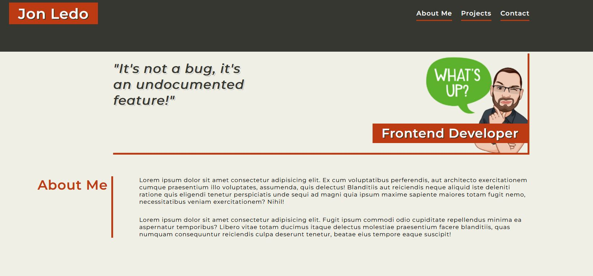

# Bootcamp Module 2 Challenge -- Portfolio

## Description

This site was built using HTML, CSS and JavaScript. It was based on the demo provided in the Assets folder, and follows it very closely. I chose a colour scheme that I enjoy, and applied them accordingly. My thought process was to picture everything on the page as part of its own box (section), and planned around using flexbox layouts for the whole page while following user story prompts. JavaScript logic was used entirely for the navbar to open/close the navigation, change the icon class, and to close the navigation when other actions are taken on the page (scrolling away, clicking elsewhere, or on a link).

### What was learned?

This project was a good reminder of how important it is to plan designs ahead of time, and to not just always jump head-first into building the site. Without planning or making big decisions early on, it's so easy to end up re-doing entire sections in order to make certain styles work.

I also learned that it's important to follow your gut instincts and follow through with something, until it's actually wrong. When making the logic for the JS click events, I had correctly thought about using a forEach method for the removeActiveClass function, but stopped when I got errors on the console saying "forEach() can't be used because ... not a function." I eventually realized how to turn an HTML Collection into an array, so that I could apply the forEach method to it, but it cost a lot of unnecessary time.

## Screenshots

### Desktop/Standard View

### Tablet/Mobile View

### Projects Section

## Credits

The avatar image used in the banner, thanks to the Mirror Avatar stickers creator found on google play store.
https://play.google.com/store/apps/details?id=com.mirrorai.app

Modified and edited using Canva.
https://www.canva.com

Finally, to make the banner have a transparent background, special thanks to Adobe Express
https://express.adobe.com/tools/remove-background

The decoration image used was found and downloaded from Pexels
https://www.pexels.com/photo/white-and-black-wooden-board-963278/
